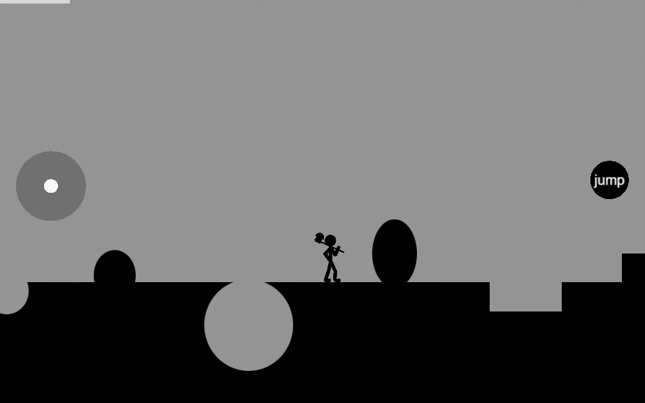
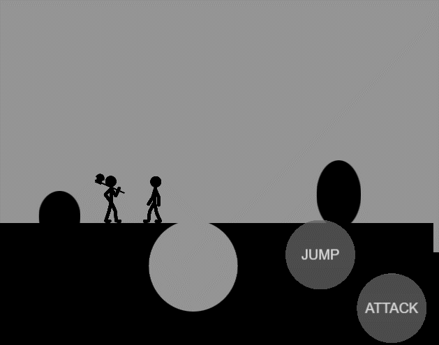
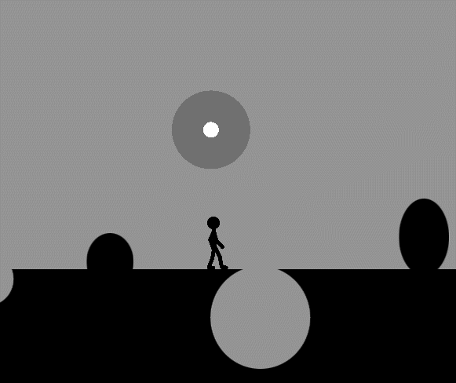

# Match Man

[原视频教程](https://www.bilibili.com/video/BV1rf4y1T73d/?vd_source=f55c755ba9aae4a4382a0f9d56858d01&spm_id_from=333.788.videopod.episodes)

cocos实现的2D横版角色跳跃功能。

包含如下内容：
- 角色移动与跳跃
- 相机跟随
- 手柄控制
- 碰撞检测
- 骨骼绑定动画切换
- 攻击判定

